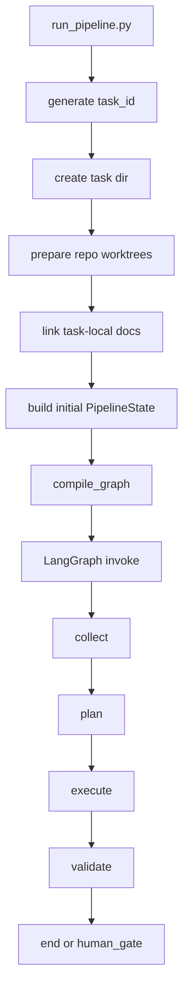
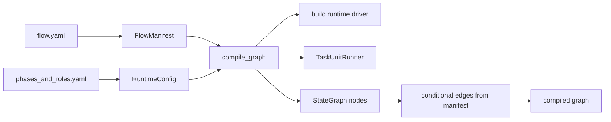
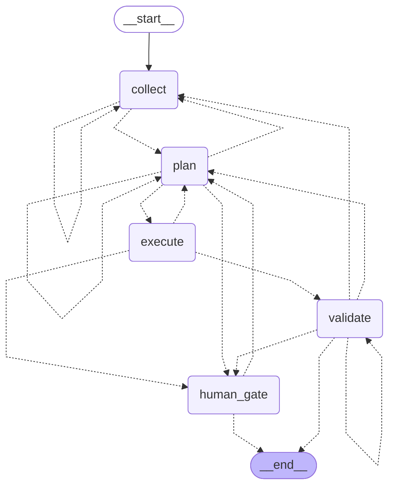
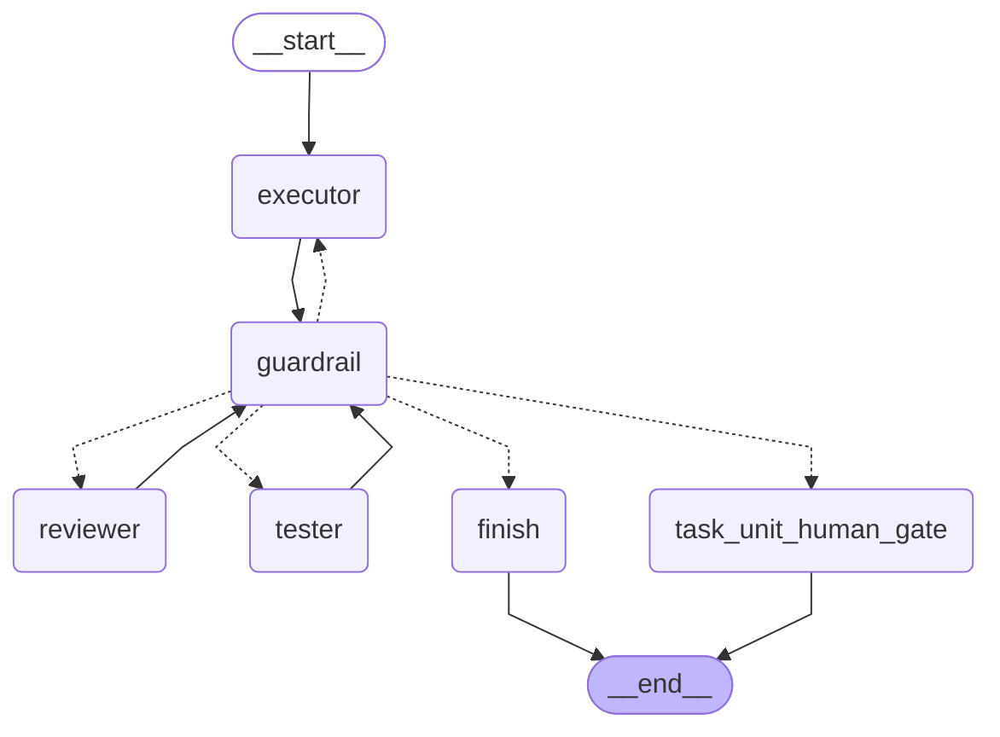
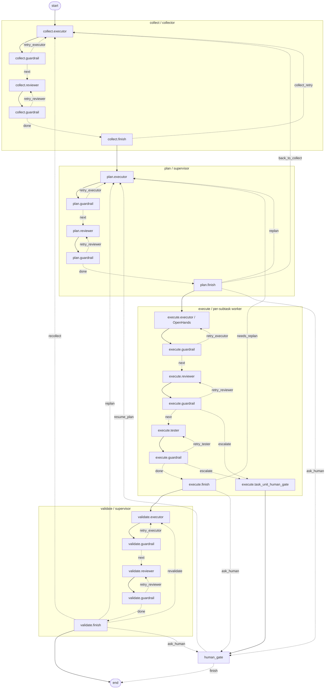

<guide-orchestrator-architecture>
# Guide: Orchestrator Architecture

## Meta
- **Status:** active
- **Related Guides:**
  - `README.md` — обзор runtime, quick start и high-level flow
  - `TASK_UNIT_LANGGRAPH_NATIVE.md` — native LangGraph topology и combined documentation view
  - `config/flow.yaml` — topology top-level phase graph
  - `config/phases_and_roles.yaml` — runtime config, pipelines, backends, prompts, guardrails
- **Last Updated:** `2026-04-08`
- **Template ver:** 1.0 (Semantic Memory Optimized)

## Cognitive Context (AI Summary)
<!-- AI:SEMANTIC_ANCHOR -->
> **Этот документ описывает:** полную архитектуру Python-оркестратора в `orchestrator/`: от entrypoint и task bootstrap до LangGraph phase flow, universal TaskUnit, runtime backends, prompt assembly, task artifacts и observability.
>
> **Ключевая цель домена:** обеспечить управляемый и проверяемый AI pipeline `collect -> plan -> execute -> validate`, в котором topology, prompts и contracts определяются конфигами и документами, а Python runtime отвечает за wiring, state transitions, artifact sync и трассировку.
>
> **Что НЕ входит сюда:** продуктовая логика Squadder, доменные правила backend/frontend и подробные роли агентов. За ними нужно идти в `Technical Docs` и role prompts.
<!-- /AI:SEMANTIC_ANCHOR -->

---

<!-- AI:TOC -->
## Содержание
1. [Назначение и архитектурные принципы](#1-назначение-и-архитектурные-принципы)
2. [Что является source of truth](#2-что-является-source-of-truth)
3. [Жизненный цикл одного pipeline run](#3-жизненный-цикл-одного-pipeline-run)
4. [State model и главные контракты](#4-state-model-и-главные-контракты)
5. [Graph compilation и phase routing](#5-graph-compilation-и-phase-routing)
6. [Что делает каждая top-level фаза](#6-что-делает-каждая-top-level-фаза)
7. [Universal TaskUnit: главное ядро runtime](#7-universal-taskunit-главное-ядро-runtime)
8. [Drivers и execution backends](#8-drivers-и-execution-backends)
9. [Как собирается prompt](#9-как-собирается-prompt)
10. [Task artifacts, worktree и task-local docs](#10-task-artifacts-worktree-и-task-local-docs)
11. [Observability, Laminar и runtime logging](#11-observability-laminar-и-runtime-logging)
12. [Тесты и как безопасно расширять систему](#12-тесты-и-как-безопасно-расширять-систему)
13. [Карта файлов и рекомендуемый порядок чтения](#13-карта-файлов-и-рекомендуемый-порядок-чтения)
<!-- /AI:TOC -->

---

## 1. Назначение и архитектурные принципы

<!-- AI:DECISION -->
Оркестратор построен как маленький, жёсткий runtime-слой поверх LLM-воркеров. Он не должен сам придумывать методологию, бизнес-правила или “умные” инструкции. Его задача: собрать topology из YAML, загрузить prompts и mandatory docs, пробросить runtime context, запустить нужный backend, проверить contracts и провести state по graph.
<!-- /AI:DECISION -->

Ключевые принципы:

- **Phase-driven orchestration.** Top-level graph фиксирован и мал: `collect -> plan -> execute -> validate -> human_gate`.
- **Manifest-driven wiring.** Python не кодирует pipeline руками по ролям; phase topology и per-step execution берутся из `config/flow.yaml` и `config/phases_and_roles.yaml`.
- **Closed-loop execution.** Почти вся работа идёт через один и тот же шаблон: executor -> guardrails -> reviewer -> guardrails -> optional tester -> guardrails.
- **Backend-agnostic core.** `TaskUnitRunner` знает только про `BaseDriver`; конкретный backend подставляется через `DriverRequest.execution_backend`.
- **Task-local artifacts.** Каждому run создаётся отдельная task-папка со своим `TASK.md`, multi-repo workspace, projected docs и runtime artifacts.
- **Trace-first observability.** Phase wrappers, TaskUnit, drivers и tool calls размечены спанами Laminar и связаны общим `trace_id`.

<!-- AI:GUARDRAILS -->
- Не добавлять в Python runtime доменные бизнес-инструкции, которые должны жить в docs/prompts.
- Не хардкодить файловые пути методологии, если они уже должны резолвиться через runtime config и workspace mapping.
- Не смешивать два уровня выбора backend:
  - `DriverMode` определяет, какой набор драйверов вообще собран для graph.
  - `ExecutionBackend` определяет, какой backend используется конкретным executor/reviewer/tester step.
<!-- /AI:GUARDRAILS -->

---

## 2. Что является source of truth

Архитектура оркестратора намеренно разложена по нескольким слоям правды.

| Слой | Главный файл | За что отвечает |
|---|---|---|
| Top-level flow | `config/flow.yaml` | Список фаз, допустимые статусы, переходы между фазами |
| Runtime pipelines | `config/phases_and_roles.yaml` | Prompt path, role_dir, backend, model, retries, guardrails, runtime defaults |
| Typed contracts | `workflow_runtime/graph_compiler/state_schema.py` | Enum-ы, `PipelineState`, `StructuredOutput`, `TaskUnitResult`, `SubtaskState` |
| Manifest parsing | `workflow_runtime/graph_compiler/yaml_manifest_parser.py` | Typed dataclass view поверх YAML |
| Cached config access | `workflow_runtime/integrations/phase_config_loader.py` | LRU-cached load, alias resolution, docs root, role metadata |
| Prompt behavior | `Technical Docs/common/roles/...` | Реальные инструкции для executor/reviewer/tester |
| Mandatory docs packet | `runtime.force_injected_common_documents` + `role.yaml` | Что force-inject-ится в prompt для backend-ов без filesystem access |
| Task memory | `task-history/<task-id>/TASK.md` и subtask cards | Task-local source of truth для конкретного run |

<!-- AI:DECISION -->
Разделение специально жёсткое:

- YAML описывает *что* запустить и куда маршрутизировать.
- Docs/prompts описывают *как агент должен думать и что считать правильным*.
- Python runtime описывает *как это выполнить, отвалидировать и трассировать*.
<!-- /AI:DECISION -->

---

## 3. Жизненный цикл одного pipeline run

Основной entrypoint сейчас: `run_pipeline.py`.

### 3.1. Что делает `run_pipeline.run()`

Порядок действий:

1. Читает runtime config через `get_runtime_config()`.
2. Генерирует `task_id` из timestamp + slug user request.
3. Создаёт task directory под `tasks_root_default`.
4. Создаёт multi-repo task workspace через `prepare_task_workspace_repositories()`.
5. Проецирует methodology docs в task directory через `prepare_task_methodology_docs()`.
6. Создаёт каталог для OpenHands conversation artifacts.
7. Собирает initial `PipelineState`.
8. Вызывает `compile_graph(driver_mode=DriverMode.LIVE)`.
9. Запускает LangGraph через отдельный traced wrapper `_invoke_compiled_graph()`.
10. Возвращает финальный state.



### 3.2. Что лежит в initial state

На старте в `PipelineState` кладутся:

- идентификаторы: `task_id`, `user_request`
- файловые корни: `workspace_root`, `task_worktree_root`, `task_workspace_repos`, `task_dir_path`
- repo routing: `primary_workspace_repo_id`, `source_workspace_roots`, `role_workspace_repo_map`
- корни методологии: `methodology_root_host`, `methodology_root_runtime`, `methodology_agents_entrypoint`
- runtime artifacts: `task_card_path`, `openhands_conversations_dir`
- runtime artifact refs/indexes: `runtime_step_refs`, `latest_step_ref_by_key`, `pending_approval_ref`, `human_decision_refs`, `cleanup_manifest_ref`
- control fields: `current_phase`, `current_status`, `phase_attempts`
- mutable runtime data: `current_state`, `plan`, `structured_outputs`, `phase_outputs`, `execution_errors`, `pending_human_input`, `final_result`

<!-- AI:CURRENT_STATE 2026-04-06 -->
Текущая реализация `run_pipeline.run()` всегда компилирует graph с `DriverMode.LIVE`, даже если внутри шаги используют не только OpenHands, но и `direct_llm` / `langchain_tools`. Это не ошибка: именно в этом режиме builder собирает hybrid `RoutingDriver`, который и умеет dispatch-ить per-step backend. Старое значение `openhands` пока ещё принимается как deprecated alias и нормализуется в `live`.
<!-- /AI:CURRENT_STATE -->

<!-- AI:CURRENT_STATE 2026-04-06 live validation -->
Живой прогон `2026-04-06_2332__as-a-multi-repo-verification-task-create-a-file-named-live-m` подтвердил этот contract на практике: запуск с `--workspace /root/dev-prod-squadder/app` создал оба repo worktree, прошёл `collect -> plan -> execute -> validate` до `PASS` и спланировал два execute-subtask-а (`devops` + `backend`) вместо схлопывания всего в один repo root.
<!-- /AI:CURRENT_STATE -->

---

## 4. State model и главные контракты

Главный файл: `workflow_runtime/graph_compiler/state_schema.py`.

### 4.1. Два уровня статусов

| Enum | Значение |
|---|---|
| `PipelineStatus` | Top-level status vocabulary для phase routing (`PASS`, `NEEDS_REPLAN`, `ESCALATE_TO_HUMAN`, ...) |
| `SubtaskStatus` | Локальный lifecycle subtask-а в execute plan (`pending`, `in_progress`, `done`, `blocked`, ...) |
| `StructuredOutputStatus` | Портируемый статус внутри `structured_output` executor-а |

Это важное разделение: phase routing не равен status полей внутри executor output.

### 4.2. Главные runtime records

| Тип | Роль |
|---|---|
| `PipelineState` | Общий state всего LangGraph run |
| `SubtaskState` | Один item mutable plan-а |
| `StructuredOutput` | Нормализованный executor result для merge и validate |
| `TaskUnitResult` | Нормализованный результат одного TaskUnit run |
| `DriverRequest` | Общий контракт входа в любой runtime driver |
| `DriverResult` | Общий контракт выхода из любого runtime driver |
| `RuntimeArtifactRef` | Компактный pointer на persisted artifact file |
| `RuntimeStepRef` | Компактный pointer на persisted step-attempt bundle |

### 4.3. Почему `PipelineState` теперь split-ит control plane и heavy artifacts

`PipelineState` хранит одновременно:

- control-plane данные: текущая фаза, статусы, попытки, pending human input
- data-plane данные: `current_state`, `plan`, `structured_outputs`, `merged_summary`
- filesystem/runtime roots: task dir, workspace root, per-repo worktrees, docs roots, conversation dirs
- compact runtime indexes: `runtime_step_refs`, `latest_step_ref_by_key`, approval/cleanup refs

Это сделано специально: каждая фаза получает не “урезанный DTO”, а полный оркестраторный state, а уже внутри wrapper-а выбирается нужный `task_context` для TaskUnit.

Но важное уточнение после runtime-storage refactor:

- state остаётся “толстым” как orchestration/control объект
- state **не** должен быть blob store для prompt/raw_text/OpenHands events
- heavy AI payload-ы живут в task-local append-only files под `runtime_artifacts/`
- state хранит только query/index layer, достаточный для resume, approval routing и human inspection

Именно это позволяет одновременно сохранить удобный graph state и не раздувать checkpoint-ы сырыми payload-ами.

### 4.4. Approval-aware runtime refs

Новый runtime vocabulary нужен для того, чтобы человек и runtime могли читать любой шаг без сериализации всего trail в `PipelineState`.

`RuntimeArtifactRef` описывает один persisted artifact:

- `artifact_kind`
- `path`
- `phase_id`
- `subtask_id`
- `sub_role`
- `attempt`
- `created_at`
- `trace_id`
- `sha256`

`RuntimeStepRef` описывает один step bundle:

- `step_key`
- `phase_id`
- `subtask_id`
- `sub_role`
- `attempt`
- `status`
- `summary_path`
- `artifact_refs`

Ключевые state-поля:

- `runtime_step_refs` — append-only журнал шагов и попыток
- `latest_step_ref_by_key` — быстрый индекс по `phase/subtask/sub_role`
- `pending_approval_ref` — ссылка на artifact текущего human question
- `human_decision_refs` — журнал принятых человеческих решений
- `cleanup_manifest_ref` — ссылка на explicit cleanup plan

---

## 5. Graph compilation и phase routing

Главные файлы:

- `workflow_runtime/graph_compiler/yaml_manifest_parser.py`
- `workflow_runtime/integrations/phase_config_loader.py`
- `workflow_runtime/graph_compiler/langgraph_builder.py`
- `workflow_runtime/graph_compiler/edge_evaluators.py`

### 5.1. Typed parsing поверх YAML

`yaml_manifest_parser.py` переводит raw YAML в dataclass-модель:

- `FlowManifest`
- `PhaseRuntimeConfig`
- `PipelineConfig`
- `PipelineStepConfig`
- `StepExecutionConfig`
- `ExecuteStrategy`

Это убирает дикое количество raw-dict логики из runtime-кода и делает wiring читаемым.

### 5.2. Cached config loader

`phase_config_loader.py` делает три важные вещи:

1. Кэширует `flow.yaml` и `phases_and_roles.yaml` через `@lru_cache`.
2. Строит alias map из `/root/squadder.code-workspace`.
3. Резолвит пути вида `Technical Docs/...`, `Project Guides/...` и `Project Skills/...` в реальные absolute paths.

Именно здесь runtime становится config-driven по путям, а не привязанным к жёстко вшитым absolute path-ам.

### 5.3. Что делает `compile_graph()`

`langgraph_builder.compile_graph()`:

- выбирает manifest и runtime config
- выбирает driver mode
- строит runtime driver через `_build_driver()`
- создаёт один `TaskUnitRunner(selected_driver)`
- регистрирует phase nodes: `collect`, `plan`, `execute`, `validate`, `human_gate`
- подключает conditional edges через `_phase_router()`
- компилирует `StateGraph(PipelineState)`



### 5.4. Native top-level orchestrator graph

Это уже не conceptual sketch, а текущая native topology, которую runtime прикладывает и в документацию, и в tracing metadata:



### 5.5. Где живёт routing-логика

- `flow.yaml` хранит декларативные transitions
- `edge_evaluators.resolve_next_phase()` смотрит на `state["current_status"]`
- `_phase_router()` оборачивает это в LangGraph-compatible callable

Иными словами: Python не решает “если validate fail, то куда дальше” вручную в куче `if`-ов; это берётся из manifest.

---

## 6. Что делает каждая top-level фаза

### 6.1. `collect`

Файл: `workflow_runtime/node_implementations/phases/collect_phase.py`

Задача фазы:

- собрать snapshot окружения и task-local контекст
- положить его в `current_state`
- передать дальше planner-у

Что передаётся в TaskUnit:

- `task_id`, `user_request`
- `source_workspace_root`
- `source_workspace_roots`
- `task_worktree_root`
- `task_dir_path`
- `openhands_conversations_dir`
- `methodology_root_runtime`
- `methodology_agents_entrypoint`
- пути task artifacts через `build_task_artifact_context()`

На `PASS` collect phase обновляет `state["current_state"] = result.payload["current_state"]`.

### 6.2. `plan`

Файл: `workflow_runtime/node_implementations/phases/plan_phase.py`

Задача фазы:

- взять collector snapshot
- сгенерировать или обновить mutable DAG plan
- синхронизировать TASK/subtask artifacts

Ключевые детали:

- planner получает `existing_plan`
- `_merge_plan()` сохраняет уже `DONE` subtasks и не теряет прогресс
- `sync_plan_to_task_artifacts()` материализует planner output в markdown artifacts

### 6.3. `execute`

Файл: `workflow_runtime/node_implementations/phases/execute_phase.py`

Задача фазы:

- пройтись по mutable plan
- запускать только ready subtasks
- накапливать `structured_outputs`

Ключевые детали:

- стратегия сейчас `planner_driven`
- `max_concurrent=1`
- `get_ready_subtasks()` выбирает `pending` subtasks, у которых все зависимости уже `done`
- если ready subtasks закончились, но план ещё incomplete, runtime либо делает `NEEDS_REPLAN`, либо уходит в `ESCALATE_TO_HUMAN` после лимита phase-attempts

### 6.4. `validate`

Файл: `workflow_runtime/node_implementations/phases/validate_phase.py`

Задача фазы:

- агрегировать все `StructuredOutput`
- проверить cross-cutting конфликты
- сформировать `final_result`

Перед запуском validator-а:

- `merge_structured_outputs()` строит `merged_summary`
- туда входят `changed_files`, `conflicts`, `warnings`, `commits`, `subtasks_completed`

### 6.5. `human_gate`

Файл: `workflow_runtime/node_implementations/human_gate.py`

Роль фазы:

- остановить pipeline на вопросе к человеку
- принять решение пользователя
- вернуть state обратно в graph

Это operational escape hatch для реальных блокеров, а не декоративная фаза “на всякий случай”.

---

## 7. Universal TaskUnit: главное ядро runtime

Главные файлы:

- `workflow_runtime/node_implementations/task_unit/runner.py`
- `workflow_runtime/node_implementations/task_unit/task_unit_graph.py`

TaskUnit нужен затем, чтобы все фазы пользовались одним и тем же lifecycle execution.
Сейчас это уже не просто imperative orchestration внутри одного runner-метода, а отдельный внутренний LangGraph subgraph, который сохраняет наружу тот же контракт `TaskUnitResult`, но внутри строит явные conditional transitions между executor/reviewer/tester/guardrail/human_gate.

Важно: happy-path contract не менялся. Наружная семантика по-прежнему такая: `executor -> reviewer -> tester`. Shared `guardrail` node и conditional edges — это implementation detail retry/routing, а `human_gate` остаётся только bounded escape path, когда retry budget исчерпан или phase status прямо требует человека.



### 7.1. Combined detailed view: phase graph + TaskUnit internals

Этот view не эмитится LangGraph напрямую как один graph, но полезен как читаемая runtime карта:



### 7.2. Что важно внутри `TaskUnitRunner`

- `TaskUnitRunner.run()` теперь в основном выступает как thin wrapper над `run_task_unit_subgraph(...)`
- retry loop больше не “зашит” вручную в imperative коде runner-а, а живёт в `task_unit_graph.py`
- executor/reviewer/tester все проходят через один и тот же `guardrail_node`
- `route_after_guardrail()` использует `step_attempts`, `latest_guardrail_result`, driver status и `max_retries` из runtime config
- после `PASS` executor-а runtime может сразу:
  - применить `task_artifact_writes`
  - синхронизировать task cards из `structured_output`
- в retry prompt context подмешиваются:
  - `previous_guardrail_failures[]`
  - `latest_guardrail_feedback`
  - `previous_feedback`
- для `execute` exhausted retry budget переводится в `task_unit_human_gate`, а не в бесконечный цикл remediation

Отдельно после runtime-storage refactor каждый значимый узел теперь persist-ит step-local artifacts:

- executor/reviewer/tester пишут step bundle через `persist_driver_step_artifacts(...)`
- guardrail пишет `guardrail_result.json` и обновляет `step_summary.json`
- finish пишет `task_unit_result.json`
- `task_unit_human_gate` пишет approval question artifact до interrupt

### 7.3. Special case для collect

`_build_downstream_task_context()` делает важное исключение:

- для `collect` reviewer не получает сырой `executor_payload` как у worker phases
- вместо этого он получает:
  - `current_state` из collector result
  - `collector_result_meta` (`status`, `warnings`)

Идея простая: reviewer collect-фазы проверяет уже собранный snapshot, а не “структуру structured_output”, которой у collect вообще нет.

### 7.4. Что возвращает TaskUnit наружу

`TaskUnitResult` может содержать:

- `status`
- `payload`
- `structured_output`
- `review_feedback`
- `test_summary`
- `warnings`
- `executor_attempts_used`
- `conversation_id`
- `runtime_step_refs`
- `latest_step_ref_by_key`
- `pending_approval_ref`

Phase wrapper-ы принимают этот результат и уже сами решают, какие поля state обновить.

---

## 8. Drivers и execution backends

Главные файлы:

- `workflow_runtime/agent_drivers/base_driver.py`
- `workflow_runtime/agent_drivers/routing_driver.py`
- `workflow_runtime/agent_drivers/mock_driver.py`
- `workflow_runtime/agent_drivers/openhands_driver.py`
- `workflow_runtime/agent_drivers/direct_llm_driver.py`
- `workflow_runtime/agent_drivers/langchain_tools_driver.py`

### 8.1. Два уровня выбора backend

| Уровень | Где задаётся | Для чего нужен |
|---|---|---|
| `DriverMode` | `compile_graph(...)` | Выбрать общий режим сборки graph driver-а |
| `ExecutionBackend` | `phases_and_roles.yaml` для каждого step | Выбрать реальный backend конкретного executor/reviewer/tester |

### 8.2. Реальные backend-ы

| Backend | Где реализован | Когда нужен |
|---|---|---|
| `mock` | `mock_driver.py` | unit tests, deterministic dry-run |
| `openhands` | `openhands_driver.py` | tool-rich worker execution через OpenHands agent server |
| `direct_llm` | `direct_llm_driver.py` | быстрый single-shot step без tools |
| `langchain_tools` | `langchain_tools_driver.py` | tool-calling loop без полного OpenHands overhead |

### 8.3. Текущий hybrid runtime profile

<!-- AI:CURRENT_STATE 2026-04-06 -->
Текущий `phases_and_roles.yaml` распределяет backend-ы так:

- `collect.executor` -> `langchain_tools`
- `collect.reviewer` -> `direct_llm`
- `plan.executor` -> `direct_llm`
- `plan.reviewer` -> `direct_llm`
- `execute.executor` -> `openhands`
- `execute.reviewer` -> `direct_llm`
- `execute.tester` -> `langchain_tools`
- `validate.executor` -> `direct_llm`
- `validate.reviewer` -> `direct_llm`
<!-- /AI:CURRENT_STATE -->

### 8.4. Чем backend-ы различаются по механике

**`OpenHandsDriver`**

- создаёт conversation через `OpenHandsHttpApi`, а для executor retry может продолжать уже существующую через `send_message(...)`
- запускает run
- ждёт completion через native events WebSocket path с fallback на HTTP polling
- забирает events
- извлекает agent reply text
- нормализует YAML payload
- сохраняет conversation artifact рядом с задачей
- по умолчанию не подменяет native OH trace synthetic event spans; fallback synthetic spans включаются только явным флагом для debug-сценариев, когда remote trace linkage реально потерян

**`DirectLlmDriver`**

- делает direct provider attempt через `llm.stream(...)` when available, с fallback на `invoke()`
- завёрнут в watchdog timeout на отдельном thread
- различает hard `timeout_seconds` и idle `idle_timeout_seconds`
- автоматически расширяет effective hard/idle budget для больших prompt-ов и уважает per-step `execution.runtime_overrides`
- умеет retry/backoff
- создаёт granular Laminar spans для retry-loop, provider attempt, timeout и backoff

**`LangChainToolsDriver`**

- строит tool-calling loop на `ChatOpenAI`
- даёт ограниченный набор tools:
  - `read_file`
  - `write_file`
  - `glob_paths`
  - `search_contents`
  - `run_shell`
- ограничивает файловый доступ runtime roots из task context
- для `read/search/glob/shell` дополнительно разрешает source workspace roots из `source_workspace_root` / `source_workspace_roots`, чтобы collector и runtime validation могли читать исходные checkout-ы по абсолютным путям без падения на `Path is outside allowed runtime roots`

### 8.5. Почему runtime сейчас гибридный

Текущий split backend-ов не случайный, а выведен из живых прогонов и latency-профиля:

- `OpenHands` оставлен там, где реально нужен длинный tool-using worker loop с редактированием файлов и shell execution.
- `direct_llm` используется там, где нужен строго bounded single-shot reasoning без filesystem freedom.
- `langchain_tools` нужен для промежуточного случая: tools нужны, но полный OpenHands conversation loop даёт слишком большой overhead.

Практический смысл такого split:

- `collect` выгодно делать через `langchain_tools`, потому что там нужен controlled filesystem/search доступ.
- `plan` и `validate` выгодно делать через `direct_llm`, потому что там важнее structured reasoning и дешевле обходиться без OH loop.
- `execute.executor` оставлен на `OpenHands`, потому что именно этот шаг чаще всего требует реального code-editing workflow.
- `execute.reviewer` и часть validation шагов вынесены из OH, чтобы не платить за ещё одну conversation там, где tools не обязательны.

### 8.6. Runtime invariants для backend selection

<!-- AI:GUARDRAILS -->
- Для каждого step backend выбирается из YAML и должен оставаться видимым в trace tree как отдельный semantic span, а не как “скрытая внутренняя ветка”.
- `OpenHands` не должен использоваться по инерции “везде”, если step можно выполнить bounded single-shot или bounded tool-agent loop.
- Если `direct_llm` или `langchain_tools` включены в runtime config, `_build_driver()` должен fail-fast при отсутствии API key, а не падать поздно уже внутри collect/plan.
- Базовая модель сейчас унифицирована как `openrouter/z-ai/glm-5` на всех phase steps, чтобы поведение reviewer/tester и regression tests было максимально предсказуемым.
<!-- /AI:GUARDRAILS -->

---

## 9. Как собирается prompt

Главный файл: `workflow_runtime/integrations/prompt_composer.py`

<!-- AI:DECISION -->
Prompt composer intentionally “тупой”. Он не должен придумывать стратегию. Он только склеивает:

1. base prompt markdown из `step_config.prompt.path`
2. force-injected mandatory docs
3. runtime task context
4. output contract
<!-- /AI:DECISION -->

### 9.1. Force-injected packet

Для `direct_llm` шагов backend сам не умеет ходить по файловой системе, поэтому runtime force-inject-ит:

- `runtime.force_injected_common_documents`
- `runtime.role_metadata_path`
- `role.yaml -> force_injected_documents`

На данный момент common packet включает:

- `AGENTS.md`
- `common/critical_concept_flow.md`
- `common/common_rules.md`
- `common/procedures/task_management.md`
- `common/templates/task_template.md`

#### Текущая forced-docs matrix по ролям

<!-- AI:CURRENT_STATE 2026-04-06 -->

| Фаза | Роль | Что inject-ится всегда |
|---|---|---|
| `collect` | `collector` | global common packet + `collector/role.yaml` + `AGENTS_PROJECT.md` + `AI_ARCHITECT_GUIDE.md` |
| `plan` / `validate` | `supervisor` | global common packet + `supervisor/role.yaml` + `AGENTS_PROJECT.md` + `AI_ARCHITECT_GUIDE.md` |
| `execute` | `devops` | global common packet + `devops/role.yaml` + `AGENTS_PROJECT.md` + `code_semantic_markup.md` + `ai_friendly_logging_markup.md` + `DEVOPS_GUIDE.md` |
| `execute` | `backend` | global common packet + `backend/role.yaml` + `AGENTS_PROJECT.md` + `code_semantic_markup.md` + `ai_friendly_logging_markup.md` + `BACKEND_GUIDE.md` |
| `execute` | `architect` | global common packet + `architect/role.yaml` + `AGENTS_PROJECT.md` + `AI_ARCHITECT_GUIDE.md` + `guides_semantic_markup.md` + `adr_template.md` |

<!-- /AI:CURRENT_STATE -->

### 9.2. Runtime Task Context

После force-injected docs composer добавляет секцию `## Runtime Task Context`, где YAML-подобно рендерит:

- task ids
- корни workspace/worktree/docs
- `current_state`
- `existing_plan`
- `merged_summary`
- task artifact paths

### 9.3. Output Contract

Output contract зависит от phase и sub-role:

- collect executor -> `status, current_state, warnings`
- plan executor -> `status, plan, warnings`
- validate executor -> `status, cross_cutting_result, final_result, warnings`
- reviewer -> `status, feedback, warnings`
- tester -> `status, result, tests_passed, warnings`
- execute executor -> `status, structured_output, warnings`

Это нужно не только агенту, но и driver parser-у.

### 9.4. Почему code не должен “обогащать методологию”

Если какому-то шагу нужна дополнительная предметная инструкция, она должна жить:

- в role prompt markdown
- в force-injected doc list
- в самом task artifact

Но не в Python-конкатенации ad hoc инструкций. Это принципиально для поддержки и predictability.

### 9.5. Bootstrap contract для методологии

Из живых прогонов и фикс-проходов закреплён следующий контракт:

- статический framework knowledge не должен сериализоваться collector-ом в `current_state`
- любой агент должен стартовать с `AGENTS.md` как с единой entrypoint-точки
- collector передаёт вниз только динамический snapshot среды и task artifacts
- runtime знает только путь к entrypoint и mandatory packet; он не должен симулировать “внутреннее знание” за агента

Именно поэтому современный `prompt_composer.py` больше не строит произвольные docs-chain и не навязывает hardcoded strategy sections поверх docs.

---

## 10. Task artifacts, worktree и task-local docs

Главные файлы:

- `workflow_runtime/integrations/tasks_storage.py`
- `workflow_runtime/integrations/task_worktree.py`

### 10.1. Layout одной задачи

Типичный layout под `task-history/<task-id>/`:

```text
<task-id>/
├── TASK.md
├── workspace/
│   ├── devops/
│   └── backend-prod/
├── docs -> symlink на methodology root
└── runtime_artifacts/
    ├── openhands_conversations/
    ├── step_payloads/
    │   └── <phase>/<subtask-or-phase-level>/<sub_role>/attempt-001/
    │       ├── step_summary.json
    │       ├── driver_request.json
    │       ├── prompt.txt
    │       ├── raw_text.md
    │       ├── parsed_payload.json
    │       ├── guardrail_result.json
    │       ├── task_unit_result.json
    │       ├── human_gate_question.json
    │       ├── human_gate_decision.json
    │       └── artifact_refs.json
    └── cleanup/
        └── cleanup_manifest.json
```

### 10.2. Что делает `tasks_storage.py`

Этот модуль даёт stable path contract для runtime:

- `resolve_task_directory()`
- `resolve_task_card()`
- `resolve_subtask_card()`
- `resolve_openhands_conversations_directory()`
- `resolve_task_worktree_directory()`
- `resolve_step_payloads_directory()`
- `resolve_step_attempt_directory()`
- `build_runtime_step_key()`

Также здесь живут helper-ы, которые:

- строят `task_artifact_context`
- синхронизируют planner output в markdown artifacts
- применяют `task_artifact_writes`
- материализуют `structured_output` в task/subtask cards
- сохраняют OpenHands conversation artifacts
- persist-ят driver step bundles, guardrail verdicts, human-gate artifacts и cleanup manifest

### 10.3. Что делает `task_worktree.py`

`prepare_task_workspace_repositories()`:

- читает список repo из `runtime.task_repositories[]`
- создаёт `task_dir/workspace/<repo-id>` для каждой repo
- вызывает `prepare_task_worktree()` per repo с отдельным source repo и sparse profile

`prepare_task_worktree()`:

- проверяет, что source repo — это git repository
- создаёт branch `<branch_prefix>/<task_id>`
- создаёт worktree в `task_dir/workspace/<repo-id>`
- по необходимости включает sparse checkout

`prepare_task_methodology_docs()`:

- делает symlink `task_dir/docs -> methodology_source_root`
- гарантирует, что task-local runtime видит проектную методологию по стабильному пути

### 10.4. Уточнённый path contract

Из серии live-fix прогонов зафиксирован следующий target contract:

- `task_dir/` — корень task-specific артефактов и runtime памяти
- `task_dir/workspace/` — контейнер task-local workspace
- `task_dir/workspace/devops` и `task_dir/workspace/backend-prod` — реальные git worktree отдельных репозиториев
- `task_dir/docs/` — projected methodology root, доступный runtime и агентам как отдельный read-only слой
- `task_dir/runtime_artifacts/openhands_conversations/` — persisted OH artifacts рядом с задачей
- `task_dir/runtime_artifacts/step_payloads/` — append-only step-local payload bundles
- `task_dir/runtime_artifacts/cleanup/cleanup_manifest.json` — explicit plan того, что можно удалять только после отдельного approval

Практический смысл:

- phase-level `working_dir` может указывать на `task_worktree_root` как на общий workspace container
- execute subtask-ы должны выбирать repo-specific `working_dir` через `role_workspace_repo_map` + `task_workspace_repos`
- методология должна быть отдельным путём, а не подменять собой рабочую папку агента
- `LangChainToolsDriver` и prompt/runtime context должны уметь корректно резолвить alias paths относительно projected docs root
- человек и debug tooling должны уметь восстановить полный step trail по `step_summary.json` и связанным artifact refs

<!-- AI:CURRENT_STATE 2026-04-06 -->
Старый orchestrator-specific sparse special-case удалён. Layout repo worktree теперь определяется только YAML-конфигом `runtime.task_repositories[]`.
<!-- /AI:CURRENT_STATE -->

<!-- AI:CURRENT_STATE 2026-04-06 live validation -->
Тот же live run подтвердил, что `role_workspace_repo_map` реально маршрутизирует execute-subtask-и по разным checkout root:

- `devops` subtask создал `workspace/devops/live-multi-repo-devops.txt`
- `backend` subtask создал `workspace/backend-prod/live-multi-repo-backend.txt`

То есть multi-repo layout уже не только config contract, а проверенный runtime behavior.
<!-- /AI:CURRENT_STATE -->

### 10.5. Контракт parent/subtask artifacts

Это один из самых важных runtime contracts, потому что на нём завязаны checklist guardrails.

Правила:

- для phase-level context (`collect`, `plan`, `validate`) parent `TASK.md` является **optional artifact**
- для subtask-level context внутри `execute` parent `TASK.md` является **mandatory artifact**
- subtask card должна передаваться вместе с parent task card
- успешный `structured_output` executor-а должен быть синхронизирован в markdown artifacts **до** checklist validation

Иначе runtime получает ложные ошибки вида:

- checklist guardrail не видит, что задача уже фактически выполнена
- tool-agent падает на несуществующем `TASK.md`, хотя planner ещё не обязан был его создать
- trace становится “красным” не из-за phase failure, а из-за побочных artifact/path errors

### 10.6. Почему task artifacts считаются частью control plane

`TASK.md` и subtask cards здесь не просто “человекочитаемый отчёт”.

Они участвуют в runtime execution как:

- source of truth для checklist enforcement
- runtime-visible memory между phase-ами
- материализованный результат planner-а
- вход reviewer/tester/validator шагов

То есть в архитектуре orchestrator markdown artifacts являются не вторичной документацией, а частью реального control/data flow.

### 10.7. Runtime step replay, human approval и cleanup

Runtime storage теперь специально разделяет три разных смысла:

- `approve/continue` — можно продолжать graph execution или принять текущее решение
- `human_decision_refs` — durable журнал того, что именно решил человек
- `cleanup_manifest_ref` — отдельный explicit список ресурсов, которые можно удалить только после отдельной cleanup-команды

Это принципиально: approval текущего шага не равен разрешению на удаление worktree, branch-ей или runtime artifacts.

Практический read path теперь такой:

1. взять `PipelineState.runtime_step_refs` или `latest_step_ref_by_key`
2. открыть `step_summary.json`
3. по `artifact_refs` перейти к `prompt`, `raw_text`, `parsed_payload`, `guardrail_result`, `task_unit_result`, `human_gate_*`, `openhands_conversation`

Для этого добавлен read-only helper `show_step_state.py`:

```bash
uv run python show_step_state.py <task_id> <phase_id> <sub_role> --subtask <subtask_id> --attempt <n> --include-artifacts
```

Live verification `2026-04-08` подтвердила этот contract end-to-end: pipeline прошёл до `PASS`, `live-step-state-check.txt` был создан в task-local worktree, а реальные `step_summary.json` и `cleanup_manifest.json` появились и прочитались helper-ом.

<!-- AI:GUARDRAILS -->
- Не писать в исходный workspace напрямую, если работа должна идти в task worktree.
- Не разрушать contract task directory layout: на него завязаны drivers, artifact sync и guardrails.
<!-- /AI:GUARDRAILS -->

---

## 11. Observability, Laminar и runtime logging

Главные файлы:

- `workflow_runtime/integrations/observability.py`
- `workflow_runtime/integrations/runtime_logging.py`
- `run_pipeline.py`

### 11.1. Trace id

`observability.py` хранит `trace_id` в `ContextVar`:

- `get_trace_id()`
- `set_trace_id()`
- `ensure_trace_id()`

Это сквозной идентификатор, который используют:

- phase wrappers
- `TaskUnitRunner`
- config loaders
- OpenHands polling
- runtime logging

### 11.2. Laminar spans

Laminar размечает:

- `pipeline_run`
- `langgraph_orchestrator_workflow`
- `langgraph_compile_graph`
- `phase_collect`, `phase_plan`, `phase_execute`, `phase_validate`, `phase_human_gate`
- `task_unit_run`
- `task_unit_langgraph_workflow`
- `task_unit_executor_node`, `task_unit_guardrail_node`, `task_unit_reviewer_node`, `task_unit_tester_node`, `task_unit_human_gate`, `task_unit_finish`
- backend-specific spans
- tool-level spans в `LangChainToolsDriver`

Отдельно важный случай: `DirectLlmDriver` создаёт child spans:

- `direct_llm_run_task`
- `direct_llm_retry_loop`
- `direct_llm_provider_attempt`
- `direct_llm_timeout`
- `direct_llm_retry_backoff`

Это нужно, чтобы parent duration не выглядела “магическим пустым временем”.

Для LangGraph visualization Laminar не требует отдельного custom adapter: достаточно, чтобы сам graph execution был traced и его node functions тоже были traced. Поэтому текущий контракт выглядит так:

- `run_pipeline.run()` даёт верхнеуровневый run span и публикует `pipeline.task_id`, `pipeline.primary_workspace_repo_id`, `pipeline.source_workspace_root`, `pipeline.task_workspace_repo_ids`
- `compile_graph()` даёт отдельный span на graph compilation, публикует `driver_mode` / phase ids / start / end и теперь тоже прикладывает `langgraph.nodes` / `langgraph.edges`
- `_invoke_compiled_graph()` даёт отдельный span именно на `graph.invoke(...)` и добавляет `pipeline.task_id`, `pipeline.start_phase`, `pipeline.primary_workspace_repo_id`, `pipeline.task_workspace_repo_ids`, а также `langgraph.nodes` / `langgraph.edges`
- phase nodes (`phase_collect`, `phase_plan`, `phase_execute`, `phase_validate`, `phase_human_gate`) остаются observed functions внутри graph execution
- `debug_step.py` использует тот же multi-repo bootstrap и traced `graph.stream(...)`, чтобы debug entrypoint не отставал от основного runtime contract

Это ближе к рекомендованному Laminar-паттерну и делает graph-level trace выразительнее без отдельной vendor-specific интеграции.

Для TaskUnit subgraph действует такой же принцип: `run_task_unit_subgraph()` после compile прикладывает `langgraph.nodes` / `langgraph.edges` на span `task_unit_langgraph_workflow`, чтобы Laminar UI видел topology внутреннего subgraph-а, а не только node-level spans.

<!-- AI:CURRENT_STATE 2026-04-06 live validation -->
На живом run также наблюдался реальный retry-path у `DirectLlmDriver`: planner executor пережил watchdog timeout на первом attempt, а `devops` execute reviewer завершился только на третьем provider attempt. Несмотря на это, pipeline дошёл до `PASS`, что подтверждает, что attempt-level spans и retry/backoff contract работают на боевом execution path, а не только в тестах.
<!-- /AI:CURRENT_STATE -->

### 11.3. Runtime logging

`runtime_logging.py` даёт единый logger для runtime modules. Основной паттерн логов:

- `ContextAnchor`
- `PreCheck`
- `DecisionPoint`
- `BeliefState`
- `StepComplete`
- `ErrorHandled`

То есть logging здесь не “случайный print”, а часть архитектуры наблюдаемости.

### 11.4. Как OH встраивается внутрь trace tree orchestrator-а

Один из самых нетривиальных слоёв системы находится не в graph, а в cross-process trace propagation между orchestrator и OpenHands.

Закреплённый контракт такой:

- OpenHands server нужно запускать через `start_oh_server.py`, а не напрямую
- wrapper должен нормализовать `LAMINAR_*` alias-ы в `LMNR_*` и заранее инициализировать Laminar, иначе exporter может молча уйти в дефолтный `api.lmnr.ai` backend вместо локального runtime target
- если Laminar base URL задан как plain `http://...` без порта, wrapper должен использовать self-hosted HTTP default `8000`, а не `80`, потому что в локальном runtime `http://localhost` редиректит `301 -> https://localhost/...` через openresty и ломает exporter path
- orchestrator HTTP client отправляет `x-lmnr-parent-ctx` на OH requests
- wrapper вокруг OH server читает parent context и использует его как родителя для conversation spans
- тот же wrapper должен удержать этот linked conversation root span живым после `/run`, переактивируя его сначала внутри `EventService.run(...)` / `send_message(...)`, а затем внутри `LocalConversation.run(...)` / `send_message(...)`, иначе native OH child spans могут потеряться на asyncio/executor boundary

Именно это позволяет получить целевую вложенность:

```text
pipeline_run
└── phase_execute
    └── task_unit_run
        └── openhands_run_task
            └── conversation.run / agent.step / litellm.completion / actions
```

Без этого OH conversation легко уезжает в отдельный trace, и тогда Laminar перестаёт показывать реальный end-to-end flow.

Это distinction важно и для диагностики: если в live trace видно `openhands_run_task`, но не видно native OH subtree, это не означает, что `execute.executor` "не пошёл через OpenHands". Live multi-repo smoke уже подтвердил обратное; чаще проблема именно в том, что conversation-root span был создан и linked, но downstream OH runtime потерял активный span context.

Если linkage временно сломан и нужно хотя бы увидеть coarse-grained картину действий, `OpenHandsDriver` умеет дополнительно зеркалить event timeline в synthetic fallback spans. Но это именно аварийный режим: он включается только явным флагом и не должен заменять native OH tree в обычном live run.

### 11.5. Observability hygiene decisions

Из task card и live-run анализа закреплены ещё несколько решений:

- `start_oh_server.py` не должен вручную включать FastAPI transport instrumentation, иначе `POST/GET /api/conversations*` засоряют root trace list transport-level мусором
- если Laminar base URL задан как plain `http://...`, wrapper должен форсировать HTTP exporter bootstrap и корректный HTTP port до импорта OpenHands runtime
- `LocalFileStore.write/list/delete` считаются low-value spans для этого runtime и должны быть разинструментированы в OH wrapper-е
- auto-title generation в OH не должна красить trace из-за ancillary ошибки `No user messages found in conversation events`; для этого есть safe fallback title patch
- linked conversation root span должен храниться достаточно долго, чтобы wrapper мог выполнить `Laminar.use_span(...)` вокруг `LocalConversation.run/send_message`; одного только header capture на `/api/conversations` недостаточно
- `DirectLlmDriver` обязан разбирать retry-loop на наблюдаемые attempt-level spans, иначе wall-clock duration будет непрозрачной
- большие reviewer/validate prompt-ы нельзя гонять только на базовых `15s/120s`: runtime должен поднимать effective timeout budget либо через adaptive policy, либо через step-level overrides

### 11.6. Prompt caching через system/user message split

`compose_prompt_parts()` разделяет composed prompt на две части:

- **system_prompt** — role prompt markdown + force-injected methodology documents (~20K tokens). Стабилен для данного role/sub_role в рамках одного pipeline run.
- **user_prompt** — динамическая часть: optional checklist guardrail items, runtime task context и output contract.

`DirectLlmDriver` и `LangChainToolsDriver` помещают `system_prompt` в `SystemMessage`, а `user_prompt` в `HumanMessage`. Это активирует provider-side prompt caching (OpenRouter, Anthropic, OpenAI): на итерациях 2+ tool-loop тот же system prefix не перерабатывается заново.

Важно: checklist block попадает в `user_prompt` только если для шага активен `ensure_checklist` и реально найдены unchecked checklist entries в prompt chain / force-injected docs. То есть dynamic section не раздувается безусловно для каждого шага.

До этого изменения tool loop с 3 итерациями отправлял 22K → 24K → 26K tokens input. С prompt caching — первый вызов 22K, последующие используют cache hit для ~20K prefix, фактически обрабатывая только ~2-6K новых tokens.

`OpenHandsDriver` использует `prompt` (конкатенацию обеих частей) как единую строку, т.к. OH API не поддерживает system/user разделение.

### 11.7. Events WebSocket wait вместо HTTP polling

`OpenHandsHttpApi.wait_until_finished()` теперь сначала пробует нативный OpenHands events websocket на `/sockets/events/{conversation_id}?resend_mode=all`. Это обычный FastAPI WebSocket endpoint из `openhands.agent_server.sockets`, а не Socket.IO namespace. Если по stream приходит terminal action (`finish`/`FinishAction`) или error observation — клиент сразу фетчит финальное состояние через HTTP и завершает wait без polling fallback.

Если websocket path не поднялся, недоступен по сети или закончился без terminal state — выполняется контролируемый fallback на прежний `_wait_http_polling()` path c HTTP GET polling и exponential backoff.

Live status на `2026-04-07`: event-driven wait уже доказан live-run'ом. Client logs показали `Events websocket connected`, затем `Terminal action observed on websocket`, а финальный state был получен без HTTP polling fallback. Дополнительно live probe доказал server-side capture `x-lmnr-parent-ctx` через confirmation headers на `/api/conversations`, `/run`, `/events/search`.

Что всё ещё не доказано live-run'ом: последняя observability-linkage часть `middleware captured -> _start_observability_span ... parent_ctx=present -> native OH child spans under openhands_run_task`. То есть header capture уже подтверждён, но native OH child-span restoration пока остаётся открытым residual blocker-ом.

Это убирает 5-15s idle gaps на каждом OH execution step, которые раньше уходили в паузы между poll-ами.

### 11.8. Как сейчас лучше проверять trace correctness

UI Laminar полезен для чтения дерева, но для строгой проверки в этом проекте более надёжным источником считается ClickHouse query по spans.

Почему:

- UI может упираться в auth/session нюансы
- “красный” trace в UI может означать не failure pipeline, а дочерний error-span от tool/path issue
- SQL-проверка позволяет точно увидеть:
  - есть ли только один root `pipeline_run`
  - исчезли ли `POST/GET /api/conversations*`
  - исчезли ли `LocalFileStore.*`
  - лежат ли `direct_llm` / `langchain_tools` / `openhands` под нужным `task_unit_run`

---

## 12. Тесты и как безопасно расширять систему

### 12.1. Главные группы тестов

| Файл | Что проверяет |
|---|---|
| `tests/test_flow.py` | graph wiring, manifests, prompt composition, happy-path orchestration |
| `tests/test_runtime_backends.py` | `direct_llm` и `langchain_tools` behavior |
| `tests/test_openhands_driver.py` | OpenHands driver normalization и integration contracts |
| `tests/test_openhands_http_api.py` | HTTP/events-websocket wait behavior и OpenHands API client contracts |
| `tests/test_openhands_runtime.py` | OpenHands runtime/tool naming contracts |
| `tests/test_checkpoint.py` | checkpoint / interrupt / resume |
| `tests/test_multi_repo_workspace.py` | multi-repo workspace bootstrap и repo routing behavior |
| `tests/test_phase_recovery.py` | recovery/import contracts around phase/task-unit helpers |
| `tests/test_show_step_state.py` | чтение persisted step summary и inline artifact loading |
| `tests/test_task_worktree.py` | task worktree provisioning |
| `tests/test_task_artifact_guardrails.py` | checklist/task artifact enforcement |
| `tests/test_start_oh_server.py` | OH server wrapper patches (LocalFileStore, title fallback) |
| `tests/mocks.py` | `ScriptedDriver` и другие doubles |

### 12.2. Если нужно расширять систему

**Добавить новый top-level phase**

Нужно обновить:

- `config/flow.yaml`
- `yaml_manifest_parser.py` / `state_schema.py`, если меняются contracts
- `langgraph_builder.py`
- новый phase wrapper
- tests на routing и graph compilation

**Добавить новый runtime backend**

Нужно обновить:

- `ExecutionBackend`
- driver implementation (`BaseDriver`)
- `_build_driver()`
- `RoutingDriver`
- tests на backend behavior

**Добавить новый guardrail**

Нужно обновить:

- `guardrail_checker.py`
- manifest names в `phases_and_roles.yaml`
- tests на pass/fail semantics

**Изменить prompt packet**

Нужно обновить:

- `phases_and_roles.yaml`
- `role.yaml`
- `prompt_composer.py`, только если меняется сама схема склейки
- tests на prompt composition

### 12.3. Текущие ограничения и operational risks

На момент написания этого гайда correctness baseline уже подтверждён живыми hybrid smoke-run-ами, но остаются реальные ограничения:

- главный remaining bottleneck — latency, а не phase correctness
- самый дорогой runtime step обычно `execute.executor` на `OpenHands`
- второй источник wall-clock time — длинные `direct_llm` steps на большом docs-packet
- planner/validator correctness сильно зависит от качества prompt packet, потому что `direct_llm` не умеет сам читать файлы
- observability correctness для OH всё ещё зависит от того, что сервер запущен именно через `start_oh_server.py` и получил Laminar env / parent context propagation

<!-- AI:WARNING -->
Не интерпретировать “pipeline PASS” автоматически как “observability полностью идеальна”.
Нужно отдельно смотреть:

- нет ли stray error-spans
- нет ли transport noise
- совпадает ли trace tree с phase/task-unit логикой
- не ушло ли избыточное время в provider retries или OH conversation loop
<!-- /AI:WARNING -->

---

## 13. Карта файлов и рекомендуемый порядок чтения

### 13.1. Файловая карта по подсистемам

| Подсистема | Файлы |
|---|---|
| Entrypoints | `run_pipeline.py`, `debug_step.py`, `show_step_state.py` |
| Topology/config | `config/flow.yaml`, `config/phases_and_roles.yaml` |
| Typed contracts | `workflow_runtime/graph_compiler/state_schema.py`, `yaml_manifest_parser.py` |
| Builder/routing | `workflow_runtime/graph_compiler/langgraph_builder.py`, `edge_evaluators.py` |
| Phase wrappers | `workflow_runtime/node_implementations/phases/*.py`, `human_gate.py` |
| TaskUnit | `workflow_runtime/node_implementations/task_unit/*.py` |
| Drivers | `workflow_runtime/agent_drivers/*.py` |
| Prompt/config integrations | `workflow_runtime/integrations/prompt_composer.py`, `phase_config_loader.py` |
| Task filesystem model | `workflow_runtime/integrations/tasks_storage.py`, `task_worktree.py` |
| Observability | `workflow_runtime/integrations/observability.py`, `runtime_logging.py` |
| Tests | `tests/*.py` |

### 13.2. Лучший порядок чтения для нового инженера

1. `README.md` — получить high-level картину.
2. `run_pipeline.py` — увидеть реальный lifecycle одного run.
3. `config/flow.yaml` — понять topology и statuses.
4. `config/phases_and_roles.yaml` — понять, кто что запускает и на каком backend.
5. `state_schema.py` — понять contracts и vocabulary.
6. `langgraph_builder.py` — понять, как graph собирается.
7. `phases/*.py` — понять логику фаз.
8. `task_unit/runner.py` — понять реальное ядро runtime.
9. `agent_drivers/*.py` — понять исполнение.
10. `prompt_composer.py`, `tasks_storage.py`, `task_worktree.py` — понять glue и filesystem model.
11. `tests/test_flow.py` и `tests/test_runtime_backends.py` — увидеть, что считается инвариантами.

### 13.3. Короткий mental model

Если упростить максимально:

- `run_pipeline.py` создаёт task sandbox
- `compile_graph()` собирает phase machine
- каждая phase wrapper готовит `task_context`
- `TaskUnitRunner` прогоняет executor/reviewer/tester
- driver выполняет шаг на нужном backend
- guardrails и reviewers не дают “тихо пройти”
- outputs материализуются в task artifacts и обратно влияют на graph state

Это и есть вся архитектура: маленький orchestration core, жёсткие контракты и максимально вынесенная в docs/prompts методология.

</guide-orchestrator-architecture>
