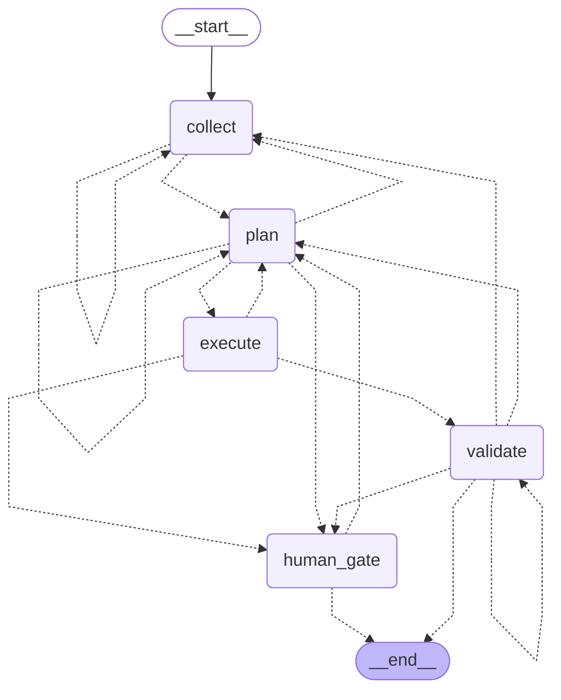
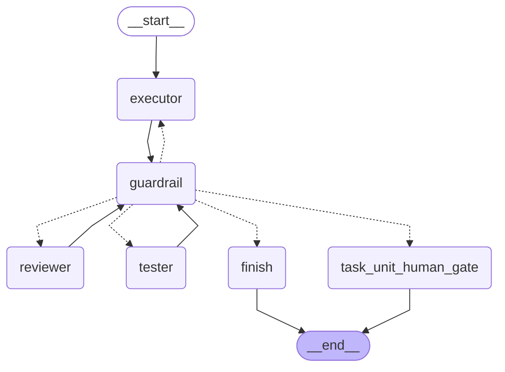
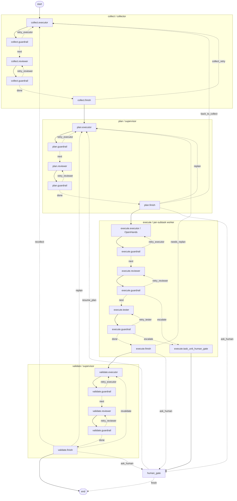

# Workflow Runtime

## Why this project exists

This workflow runtime automates AI agent work across the full software engineering pipeline: collecting context, planning, executing, and validating, while enforcing strict quality standards so output quality does not degrade as work scales.

Uncontrolled LLM execution tends to produce inconsistent results. This runtime counters that with a **closed-loop architecture**: every AI step is followed by automated guardrails and an independent AI reviewer. The reviewer catches mistakes the executor missed; guardrails enforce structural contracts. Failed steps retry or escalate to humans—never silently pass. The same **triple-check pattern** (executor → guardrails → reviewer, with optional tester and further guardrails) runs for every phase, so enforcement is systematic rather than ad hoc.

At the top level, control flow is implemented in **LangGraph**; phase topology and pipelines are driven by YAML under `orchestrator/config/`; role knowledge and prompts live under `docs/common/roles/`. Worker calls go through **`MockDriver`** (tests/dry-runs), **`DirectLlmDriver`** (single-shot LLM), **`LangChainToolsDriver`** (tool-calling loops), or **`OpenHandsDriver`** (live OH agent server), dispatched by `RoutingDriver`.

## Task workspace contract

Each pipeline run now provisions a **multi-repo task workspace** under
`runtime.tasks_root_default/<task-id>/workspace/` (default:
`/root/management-stage/task-history/<task-id>/workspace/`).

- `workspace/devops` is a task-local git worktree for `/root/squadder-devops`
- `workspace/backend-prod` is a task-local git worktree for `/root/dev-prod-squadder/app`
- the repository layout is declared in `runtime.task_repositories[]` inside `orchestrator/config/phases_and_roles.yaml`
- `task_worktree_root` now points to the workspace container directory, while per-repo paths are exposed through `task_workspace_repos`
- when `run_pipeline.py --workspace <repo-root>` is used, `_ordered_task_repositories(...)` moves the matching repo to the front; that repo becomes `primary_workspace_repo_id` and drives `workspace_root`

This removes the old single-repo / hardcoded `("orchestrator",)` sparse-checkout assumption and lets runtime steps choose the correct checkout by repo id or role mapping.

### Live validation

Verified on `2026-04-06` with a real pipeline run using:

```bash
uv run python run_pipeline.py "<multi-repo verification request>" --workspace /root/dev-prod-squadder/app
```

Observed in the successful run:

- runtime created both `workspace/backend-prod` and `workspace/devops`
- planner produced two execute subtasks: one `devops`, one `backend`
- `OpenHandsDriver` executed both repo-specific executor steps successfully
- resulting files appeared in the expected roots:
  - `workspace/devops/live-multi-repo-devops.txt`
  - `workspace/backend-prod/live-multi-repo-backend.txt`
- full pipeline finished with `Status: PASS`

## Native LangGraph topology

The runtime now documents and exports the native graph topology directly instead of relying only on simplified conceptual diagrams. The same shapes are also tracked in `TASK_UNIT_LANGGRAPH_NATIVE.md`.

### Top-level orchestrator graph



### TaskUnit subgraph

Each phase still uses the same reusable **TaskUnit**. Internally this is a LangGraph subgraph with one shared `guardrail` node and centralized routing via `route_after_guardrail(...)`. Dynamic plan shape lives in `PipelineState.plan`, execute runs TaskUnits over ready subtasks in order, and executor retries on the OpenHands backend reuse the same conversation when possible.



### Detailed combined view



## Runtime storage and step replay

The runtime now uses a **file-first append-only artifact store** instead of pushing full AI blobs into `PipelineState`.

- `PipelineState` and `TaskUnitResult` carry compact refs only: `runtime_step_refs`, `latest_step_ref_by_key`, `pending_approval_ref`, `human_decision_refs`, `cleanup_manifest_ref`
- heavy payloads stay on disk under `task-history/<task-id>/runtime_artifacts/`
- each persisted step attempt gets its own directory with `step_summary.json`, `driver_request.json`, `prompt.txt`, `raw_text.md`, `parsed_payload.json`, `guardrail_result.json`, optional `task_unit_result.json`, and links to `openhands_conversations/...`
- validate writes `cleanup/cleanup_manifest.json`, but no cleanup happens automatically; final cleanup still requires explicit user approval

Typical layout:

```text
task-history/<task-id>/
├── TASK.md
├── workspace/
├── docs
└── runtime_artifacts/
    ├── openhands_conversations/
    ├── step_payloads/
    │   └── <phase>/<subtask-or-phase-level>/<sub_role>/attempt-001/
    │       ├── step_summary.json
    │       ├── driver_request.json
    │       ├── prompt.txt
    │       ├── raw_text.md
    │       ├── parsed_payload.json
    │       ├── guardrail_result.json
    │       ├── task_unit_result.json
    │       └── artifact_refs.json
    └── cleanup/
        └── cleanup_manifest.json
```

To inspect one persisted step directly:

```bash
uv run python show_step_state.py <task_id> <phase_id> <sub_role> --subtask <subtask_id> --attempt <n> --include-artifacts
```

## Sources of truth

**Runtime manifests**

- `orchestrator/config/flow.yaml` — phase graph, statuses, transitions  
- `orchestrator/config/phases_and_roles.yaml` — per-phase pipelines, models, retries, guardrails, OpenHands transport  

**Human-readable design and prompts**

- `docs/common/roles/flow_design.md`  
- `docs/common/roles/{role}/role.yaml`  
- `docs/common/roles/{role}/{executor,reviewer,tester}.md`  
- `docs/common/roles/_shared/*.md` — общие правила для domain-ролей; tool-capable агент читает их по явным ссылкам из своего `executor.md` / `reviewer.md` / `tester.md`, а для `direct_llm` шагов оркестратор force-inject-ит общий common packet и role-specific документы из `role.yaml`, потому что у такого backend нет filesystem access  

Prompt paths are resolved from `config/phases_and_roles.yaml`. `compose_prompt` always appends **Runtime Task Context** (ключи из состояния пайплайна) and **Output Contract** (минимальные ключи YAML для парсера драйвера). Для `direct_llm` шагов он дополнительно force-inject-ит общий common packet (`AGENTS.md`, `critical_concept_flow.md`, `common_rules.md`, `task_management.md`, `task_template.md`), `role.yaml` и role-specific required docs, чтобы planner/reviewer/validator получали тот же минимально обязательный knowledge packet, что tool-агенты находят на диске.

**Design artifacts (V1 chain)**

`TASK.md` / design notes → `orchestrator/config/*` → Python phase interpreter.

| Artifact | What it describes | Path |
|----------|-------------------|------|
| **TASK.md** | V1 decisions, state schema intent, evidence | `management-stage/task-history/2026-03-24_1800__multi-agent-system-design/TASK.md` |
| **phase2-v1 subtask** | Implementation lane, structured output, evidence | `management-stage/task-history/2026-03-24_1800__multi-agent-system-design/phase2-v1-orchestrator-refactor.md` |
| **flow.yaml** | Runtime phase topology, statuses, transitions | `orchestrator/config/flow.yaml` |
| **phases_and_roles.yaml** | Runtime pipelines, prompts, retries, OpenHands settings | `orchestrator/config/phases_and_roles.yaml` |
| **flow_design.md** | Human-readable V1 rationale aligned with manifests | `docs/common/roles/flow_design.md` |
| **task framework reference** | English translations of task artifacts and worktree model | `orchestrator/reference_artifacts/task_framework/README.md` |
| **phase2-langgraph-skeleton** | Historical pre-V1 reference only | `management-stage/task-history/2026-03-24_1800__multi-agent-system-design/phase2-langgraph-skeleton.md` |

Reference translations for the task framework:

- `orchestrator/reference_artifacts/task_framework/task_template.en.md`
- `orchestrator/reference_artifacts/task_framework/task_management.en.md`
- `orchestrator/reference_artifacts/task_framework/README.md`

## YAML examples

Representative excerpts from the actual runtime manifests:

### `config/flow.yaml`

```yaml
version: "1.0"
start_phase: collect
end_phase: end

phases:
  - id: collect
  - id: plan
  - id: execute
  - id: validate
  - id: human_gate

status_types:
  - PASS
  - NEEDS_INFO
  - NEEDS_MORE_SNAPSHOT
  - NEEDS_REPLAN
  - NEEDS_FIX_EXECUTOR
  - NEEDS_FIX_REVIEW
  - NEEDS_FIX_TESTS
  - ASK_HUMAN
  - ESCALATE_TO_HUMAN
  - BLOCKED

transitions:
  - from: collect
    on_status: PASS
    to: plan
    reason: snapshot_ready
  - from: execute
    on_status: NEEDS_REPLAN
    to: plan
    reason: subtask_blocked_or_requires_new_plan
  - from: human_gate
    on_status: BLOCKED
    to: end
    reason: user_froze_or_cancelled_task
```

### `config/phases_and_roles.yaml`

```yaml
runtime:
  docs_root_alias: "Technical Docs"
  prompts_root: "Technical Docs/common/roles"
  openhands:
    base_url_env: "OPENHANDS_BASE_URL"
    llm_api_key_env: "OPENROUTER_API_KEY"
    tools:
      - "terminal"
      - "file_editor"

phases:
  execute:
    phase: execute
    strategy:
      type: planner_driven
      max_concurrent: 1
    default_worker_pipeline:
      executor:
        role_dir: "{role_dir}"
        prompt:
          sub_role: executor
          path: "Technical Docs/common/roles/{role_dir}/executor.md"
        model: "openrouter/z-ai/glm-5"
        max_retries: 3
        guardrails:
          - ensure_structured_output
          - ensure_checklist
      reviewer:
        role_dir: "{role_dir}"
        prompt:
          sub_role: reviewer
          path: "Technical Docs/common/roles/{role_dir}/reviewer.md"
        model: "openrouter/z-ai/glm-5"
        max_retries: 2
        guardrails:
          - ensure_status_field
          - ensure_feedback_field
      tester:
        role_dir: "{role_dir}"
        prompt:
          sub_role: tester
          path: "Technical Docs/common/roles/{role_dir}/tester.md"
        model: "openrouter/z-ai/glm-5"
        max_retries: 1
        guardrails:
          - ensure_status_field
          - ensure_tests_summary
```

## Package layout

```text
orchestrator/
├── config/
│   ├── flow.yaml                         # Declares the top-level phase graph and status-based transitions.
│   └── phases_and_roles.yaml             # Configures per-phase pipelines, prompts, models, retries, and backends.
├── debug_step.py                         # Debug entrypoint that streams the compiled graph step by step.
├── run_pipeline.py                       # Main CLI entrypoint: bootstraps a task folder/workspace and runs the pipeline.
├── show_step_state.py                    # CLI helper that reads persisted runtime step summaries and linked artifacts.
├── start_oh_server.py                    # Wraps the OpenHands server with trace propagation and runtime patches.
├── reference_artifacts/
│   └── task_framework/
│       ├── README.md                     # Explains why English task-framework reference docs are shipped in this repo.
│       ├── task_management.en.md         # English reference for task-card lifecycle, storage rules, and subtask splits.
│       └── task_template.en.md           # English reference for the `TASK.md` / subtask card template structure.
├── workflow_runtime/
│   ├── graph_compiler/
│   │   ├── state_schema.py               # Typed runtime vocabulary: phases, statuses, PipelineState, StructuredOutput.
│   │   ├── yaml_manifest_parser.py       # Parses `flow.yaml` and `phases_and_roles.yaml` into typed dataclasses.
│   │   ├── edge_evaluators.py            # Resolves next-phase routing from the current status and manifest transitions.
│   │   └── langgraph_builder.py          # Builds the LangGraph workflow and wires drivers, phase nodes, and edges.
│   ├── node_implementations/
│   │   ├── human_gate.py                 # Interrupt/resume node that asks the human and maps the answer back to status.
│   │   ├── status_aggregation.py         # Helpers for ready-subtask selection and merged execute/validate summaries.
│   │   ├── phases/
│   │   │   ├── collect_phase.py          # Runs the collect TaskUnit and stores the current environment snapshot.
│   │   │   ├── plan_phase.py             # Runs planning, merges/rebuilds the mutable plan, and syncs task artifacts.
│   │   │   ├── execute_phase.py          # Executes ready subtasks sequentially and accumulates structured outputs.
│   │   │   └── validate_phase.py         # Runs cross-cutting validation over merged execute results and finalizes output.
│   │   └── task_unit/
│   │       ├── executor_node.py          # Composes the executor prompt and dispatches one executor step to a driver.
│   │       ├── reviewer_node.py          # Composes the reviewer prompt and dispatches one reviewer step to a driver.
│   │       ├── tester_node.py            # Composes the tester prompt and dispatches one optional tester step.
│   │       ├── guardrail_checker.py      # Validates executor/reviewer/tester payloads against runtime contracts.
│   │       ├── task_unit_graph.py        # Internal LangGraph subgraph for executor -> guardrail -> reviewer -> tester.
│   │       └── runner.py                 # Thin TaskUnit wrapper that delegates phase/subtask execution to the subgraph.
│   ├── agent_drivers/
│   │   ├── base_driver.py                # Shared driver request/result contracts and abstract BaseDriver interface.
│   │   ├── mock_driver.py                # Deterministic backend for tests and dry-runs without real LLM/OH calls.
│   │   ├── openhands_driver.py           # OpenHands-backed backend for code-capable agent conversations.
│   │   ├── direct_llm_driver.py          # Single-shot LLM backend with retry, watchdog, and idle-timeout handling.
│   │   ├── langchain_tools_driver.py     # Tool-calling backend with bounded filesystem and shell access.
│   │   ├── routing_driver.py             # Per-step router that chooses the concrete backend by `execution_backend`.
│   │   └── yaml_contract.py              # Shared YAML parsing and payload normalization helpers for driver outputs.
│   └── integrations/
│       ├── observability.py              # Trace-id ContextVar helpers shared across runtime modules.
│       ├── openhands_http_api.py         # Low-level REST/WebSocket client for the OpenHands agent server.
│       ├── openhands_runtime.py          # Shared OpenHands constants, tool-name rules, and execution-status helpers.
│       ├── phase_config_loader.py        # Cached loaders for manifests, role metadata, alias maps, and working dirs.
│       ├── prompt_composer.py            # Glues prompt markdown, injected docs, runtime context, and output contracts.
│       ├── runtime_logging.py            # Central logging configuration and logger factory for the runtime.
│       ├── task_worktree.py              # Provisions task-local git worktrees and projected docs symlinks.
│       └── tasks_storage.py              # Resolves task paths and persists task cards, step payloads, cleanup manifests, and OH artifacts.
└── tests/                                # Test suite; file names below are already self-descriptive.
    ├── conftest.py
    ├── mocks.py
    ├── test_flow.py
    ├── test_checkpoint.py
    ├── test_multi_repo_workspace.py
    ├── test_openhands_driver.py
    ├── test_openhands_http_api.py
    ├── test_openhands_runtime.py
    ├── test_phase_recovery.py
    ├── test_runtime_backends.py
    ├── test_show_step_state.py
    ├── test_start_oh_server.py
    ├── test_task_artifact_guardrails.py
    └── test_task_worktree.py
```

## Main runtime types

- **`PipelineState`** — full state of one orchestrator run  
- **`SubtaskState`** — one mutable plan item  
- **`StructuredOutput`** — required executor result contract  
- **`TaskUnitResult`** — normalized output of the universal TaskUnit  
- **`RuntimeArtifactRef`** — compact pointer to one persisted artifact on disk  
- **`RuntimeStepRef`** — compact pointer to one persisted step attempt bundle  

## Driver modes

- **`mock`** — deterministic local driver for tests and dry-runs  
- **`live`** — canonical graph-compilation mode for the real hybrid runtime (`RoutingDriver`)  
- **deprecated alias `openhands`** — still accepted for backward compatibility, but normalizes to `live`  
- **`direct_llm`** — single-shot LLM calls via `ChatOpenAI` with retry/repair logic  
- **`langchain_tools`** — multi-turn tool-calling agent loop with read/write/shell/glob tools  
- **`ExecutionBackend.OPENHANDS`** — per-step OpenHands backend behind the live router  

`compile_graph()` resolves the driver via `RoutingDriver`: each pipeline step declares its `execution_backend` in `phases_and_roles.yaml`, and `RoutingDriver` dispatches to the corresponding concrete driver. For generic callers, fallback is explicit `driver=` → env `WORKFLOW_RUNTIME_DRIVER_MODE` → default **`mock`**. The main CLI path `run_pipeline.run()` is different: it always calls `compile_graph(driver_mode=DriverMode.LIVE)` so the hybrid `RoutingDriver` is available even when individual steps use `direct_llm` or `langchain_tools`.

`DirectLlmDriver` now enforces two different timeout guards on one provider attempt:

- hard `timeout_seconds` for the whole attempt
- idle `idle_timeout_seconds` for "no streamed progress" windows during `llm.stream(...)`

For large direct-LLM prompts, the driver also relaxes those budgets automatically before the call starts: prompt-heavy reviewer/validate steps get a larger effective hard/idle window, and any per-step `execution.runtime_overrides` from `phases_and_roles.yaml` are applied as explicit floors on top of the global defaults. This keeps the watchdog strict for small prompts while preventing large review prompts from burning multiple retries on `15s/120s` defaults.

`LangChainToolsDriver` remains a multi-call tool loop, but it now emits one `langchain_tools_provider_turn` Laminar span per blocking `invoke()` turn (tool loop, formatter fallback, repair fallback), so long waits are no longer silent black boxes.

### Prompt caching

`compose_prompt_parts()` returns `(system_prompt, user_prompt)` where the system portion (role prompt + force-injected docs, ~20K tokens) is stable across tool-loop iterations. Drivers that support message roles (`DirectLlmDriver`, `LangChainToolsDriver`) place the stable portion into a `SystemMessage`, enabling provider-side prompt caching on iterations 2+ of the tool loop.

`user_prompt` contains the dynamic runtime section only:

- optional `Checklist Guardrail Items` block, but only when `ensure_checklist` is active and unchecked checklist entries were actually discovered
- `Runtime Task Context`
- `Output Contract`

### TaskUnit contract

The universal TaskUnit still exposes the same happy-path semantics as before: `executor -> reviewer -> tester`. Internally this is now a LangGraph subgraph with one shared `guardrail` router and conditional retries, but `human_gate` remains only a bounded escape path when retry budgets are exhausted or a phase status explicitly requires human input.

### OpenHands notes

Integration is exercised against **openhands-agent-server v1.16**. Verified: conversation creation, `run`, polling conversation state, event search when `limit <= 100`, YAML payload normalization via `OpenHandsDriver`, code-capable runs with **`tools: ["terminal", "file_editor"]`**, and executor-retry conversation reuse through follow-up `send_message(...)` on an existing OpenHands conversation.

`start_oh_server.py` is a wrapper that launches the OH agent server with cross-process OTEL trace propagation: it normalizes Laminar env aliases (`LAMINAR_*` -> `LMNR_*`) before importing OpenHands, pre-initializes Laminar with `force_http=True` when the configured base URL is plain `http://...`, defaults self-hosted Laminar HTTP bootstrap to port `8000` when no explicit port is configured (because `http://localhost` on this stack redirects to `https://localhost` via openresty), wraps the served ASGI app to capture `x-lmnr-parent-ctx` headers, patches `BaseConversation._start_observability_span` to link OH spans into the orchestrator trace tree, reactivates the linked conversation root span first inside `EventService.run(...)` / `send_message(...)` and then again inside `LocalConversation.run(...)` / `send_message(...)` so native OH child spans survive both the asyncio task boundary and the later executor-thread hop after `/run`, suppresses `LocalFileStore` noise spans, and patches OH title-generation fallbacks so ancillary title errors do not pollute the trace tree.

Conversation completion detection first attempts the native **OpenHands events WebSocket** at `/sockets/events/{conversation_id}?resend_mode=all` (via `websocket-client`) and only falls back to the old HTTP GET polling loop when that websocket path cannot be established or does not reach a terminal state. The `2026-04-07` live probe proved the happy path end-to-end: websocket connect succeeded, `FinishAction` arrived over the stream, and the client completed without HTTP polling fallback.

The same live probe also proved server-side capture of `x-lmnr-parent-ctx`: the wrapper now returns confirmation headers and the client logged `server confirmed x-lmnr-parent-ctx capture` for `/api/conversations`, `/run`, and `/events/search`. A later runtime-bridge probe additionally logged `parent_ctx=present`, `conversation span linked ... stored for runtime reactivation`, and `Reactivating conversation root span for LocalConversation.run`. After the Laminar bootstrap fix, the OH server stopped emitting `UNAUTHENTICATED` exporter errors and a fresh `2026-04-08` live run completed with final pipeline `PASS`, so the runtime-side bridge and exporter bootstrap are now both validated on the same end-to-end path.

The `2026-04-06` live multi-repo smoke confirmed the hybrid path end-to-end: `collect` used `langchain_tools` + `direct_llm`, `execute` used `OpenHands` for both repo-specific executor subtasks, and `validate` completed through direct LLM with final `PASS`. In other words, the missing execute-side OH telemetry was not a routing failure; it was a native span-linkage failure inside the OH runtime.

Registered tool names in this stack are **`terminal`** and **`file_editor`**. Class-like names (e.g. `TerminalTool`, `FileEditorTool`) are not valid for the registry and produced `KeyError`-style failures; `orchestrator/config/phases_and_roles.yaml` uses the real names, and `tests/test_openhands_runtime.py` guards against regressions. No empty `tools: []` workaround is required for the local V1 path.

## Setup

```bash
cd orchestrator
uv sync
```

For a live OpenHands server (example, aligned with the current default config):

```bash
export OPENHANDS_BASE_URL="http://127.0.0.1:8011"
export OPENROUTER_API_KEY="<secret>"
export WORKFLOW_RUNTIME_DRIVER_MODE="live"   # optional; default is mock; "openhands" is a deprecated alias

uv run python start_oh_server.py --host 127.0.0.1 --port 8011
```

Adjust host/port to match `OPENHANDS_BASE_URL`.

## Running tests

```bash
uv run pytest tests/ -v
```

Coverage includes: happy-path orchestration, manifest loading, prompt composition, multi-repo workspace bootstrap, direct-LLM and LangChain-tools backends, OpenHands driver/API contracts, phase recovery, task artifact guardrails, and the `start_oh_server.py` wrapper behavior.
