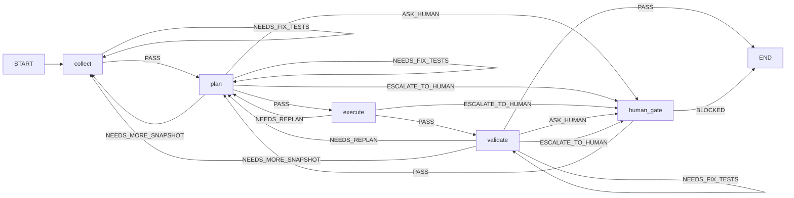
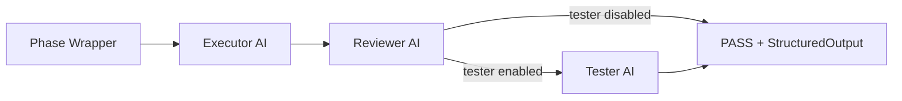
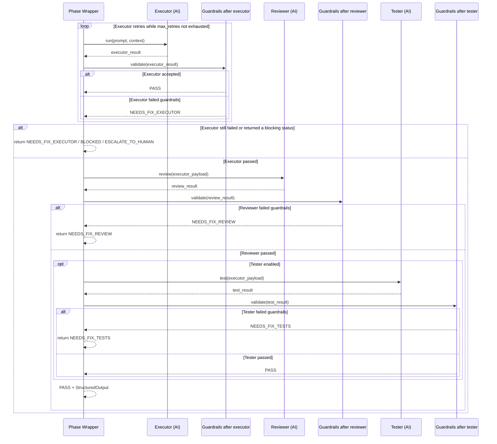

# Workflow Runtime

## Why this project exists

This workflow runtime automates AI agent work across the full software engineering pipeline: collecting context, planning, executing, and validating, while enforcing strict quality standards so output quality does not degrade as work scales.

Uncontrolled LLM execution tends to produce inconsistent results. This runtime counters that with a **closed-loop architecture**: every AI step is followed by automated guardrails and an independent AI reviewer. The reviewer catches mistakes the executor missed; guardrails enforce structural contracts. Failed steps retry or escalate to humans—never silently pass. The same **triple-check pattern** (executor → guardrails → reviewer, with optional tester and further guardrails) runs for every phase, so enforcement is systematic rather than ad hoc.

At the top level, control flow is implemented in **LangGraph**; phase topology and pipelines are driven by YAML under `orchestrator/config/`; role knowledge and prompts live under `docs/common/roles/`. Worker calls go through **`MockDriver`** (tests, dry-runs) or **`OpenHandsDriver`** (live agent server).

## Phase flow (top-level graph)



## Universal TaskUnit pipeline

Each phase uses the same reusable **TaskUnit**. In the implemented runtime, guardrails run after **every AI-producing step**: after the executor, after the reviewer, and after the tester when a tester is enabled. Dynamic plan shape is carried in `PipelineState.plan` (`SubtaskState` list), and **execute** runs TaskUnits over ready subtasks in order. The runtime retries only the **executor** inside the TaskUnit; reviewer and tester failures return immediately as `NEEDS_FIX_REVIEW` or `NEEDS_FIX_TESTS`. The first diagram below shows the main roles; the second shows the exact guardrail checkpoints and status exits.





## Sources of truth

**Runtime manifests**

- `orchestrator/config/flow.yaml` — phase graph, statuses, transitions  
- `orchestrator/config/phases_and_roles.yaml` — per-phase pipelines, models, retries, guardrails, OpenHands transport  

**Human-readable design and prompts**

- `docs/common/roles/flow_design.md`  
- `docs/common/roles/{role}/role.yaml`  
- `docs/common/roles/{role}/{executor,reviewer,tester}.md`  
- `docs/common/roles/_shared/*.md`  

Prompt and design-document locations are resolved from `config/phases_and_roles.yaml`.

**Design artifacts (V1 chain)**

`TASK.md` / design notes → `orchestrator/config/*` → Python phase interpreter.

| Artifact | What it describes | Path |
|----------|-------------------|------|
| **TASK.md** | V1 decisions, state schema intent, evidence | `management-stage/task-history/2026-03-24_1800__multi-agent-system-design/TASK.md` |
| **phase2-v1 subtask** | Implementation lane, structured output, evidence | `management-stage/task-history/2026-03-24_1800__multi-agent-system-design/phase2-v1-orchestrator-refactor.md` |
| **flow.yaml** | Runtime phase topology, statuses, transitions | `orchestrator/config/flow.yaml` |
| **phases_and_roles.yaml** | Runtime pipelines, prompts, retries, OpenHands settings | `orchestrator/config/phases_and_roles.yaml` |
| **flow_design.md** | Human-readable V1 rationale aligned with manifests | `docs/common/roles/flow_design.md` |
| **task framework reference** | English translations of task artifacts and worktree model | `orchestrator/reference_artifacts/task_framework/README.md` |
| **phase2-langgraph-skeleton** | Historical pre-V1 reference only | `management-stage/task-history/2026-03-24_1800__multi-agent-system-design/phase2-langgraph-skeleton.md` |

Reference translations for the task framework:

- `orchestrator/reference_artifacts/task_framework/task_template.en.md`
- `orchestrator/reference_artifacts/task_framework/task_management.en.md`
- `orchestrator/reference_artifacts/task_framework/README.md`

## YAML examples

Representative excerpts from the actual runtime manifests:

### `config/flow.yaml`

```yaml
version: "1.0"
start_phase: collect
end_phase: end

phases:
  - id: collect
  - id: plan
  - id: execute
  - id: validate
  - id: human_gate

status_types:
  - PASS
  - NEEDS_INFO
  - NEEDS_MORE_SNAPSHOT
  - NEEDS_REPLAN
  - NEEDS_FIX_EXECUTOR
  - NEEDS_FIX_REVIEW
  - NEEDS_FIX_TESTS
  - ASK_HUMAN
  - ESCALATE_TO_HUMAN
  - BLOCKED

transitions:
  - from: collect
    on_status: PASS
    to: plan
    reason: snapshot_ready
  - from: execute
    on_status: NEEDS_REPLAN
    to: plan
    reason: subtask_blocked_or_requires_new_plan
  - from: human_gate
    on_status: BLOCKED
    to: end
    reason: user_froze_or_cancelled_task
```

### `config/phases_and_roles.yaml`

```yaml
runtime:
  docs_root_alias: "Technical Docs"
  prompts_root: "Technical Docs/common/roles"
  openhands:
    base_url_env: "OPENHANDS_BASE_URL"
    llm_api_key_env: "OPENROUTER_API_KEY"
    tools:
      - "terminal"
      - "file_editor"

phases:
  execute:
    phase: execute
    strategy:
      type: planner_driven
      max_concurrent: 1
    default_worker_pipeline:
      executor:
        role_dir: "{role_dir}"
        prompt:
          sub_role: executor
          path: "Technical Docs/common/roles/{role_dir}/executor.md"
        model: "openhands/claude-sonnet-4-5-20250929"
        max_retries: 3
        guardrails:
          - ensure_structured_output
          - ensure_checklist
      reviewer:
        role_dir: "{role_dir}"
        prompt:
          sub_role: reviewer
          path: "Technical Docs/common/roles/{role_dir}/reviewer.md"
        model: "openhands/claude-sonnet-4-5-20250929"
        max_retries: 2
        guardrails:
          - ensure_status_field
          - ensure_feedback_field
      tester:
        role_dir: "{role_dir}"
        prompt:
          sub_role: tester
          path: "Technical Docs/common/roles/{role_dir}/tester.md"
        model: "openhands/gpt-5-mini-2025-08-07"
        max_retries: 1
        guardrails:
          - ensure_status_field
          - ensure_tests_summary
```

## Package layout

```text
orchestrator/
├── config/
│   ├── flow.yaml
│   └── phases_and_roles.yaml
├── reference_artifacts/
│   └── task_framework/
│       ├── README.md
│       ├── task_management.en.md
│       └── task_template.en.md
├── workflow_runtime/
│   ├── graph_compiler/
│   │   ├── state_schema.py
│   │   ├── yaml_manifest_parser.py
│   │   ├── edge_evaluators.py
│   │   └── langgraph_builder.py
│   ├── node_implementations/
│   │   ├── human_gate.py
│   │   ├── status_aggregation.py
│   │   ├── phases/
│   │   │   ├── collect_phase.py
│   │   │   ├── plan_phase.py
│   │   │   ├── execute_phase.py
│   │   │   └── validate_phase.py
│   │   └── task_unit/
│   │       ├── executor_node.py
│   │       ├── reviewer_node.py
│   │       ├── tester_node.py
│   │       ├── guardrail_checker.py
│   │       └── runner.py
│   ├── agent_drivers/
│   │   ├── base_driver.py
│   │   ├── mock_driver.py
│   │   └── openhands_driver.py
│   └── integrations/
│       ├── observability.py
│       ├── openhands_http_api.py
│       ├── openhands_runtime.py
│       ├── phase_config_loader.py
│       ├── prompt_composer.py
│       └── tasks_storage.py
└── tests/
    ├── conftest.py
    ├── mocks.py
    ├── test_flow.py
    ├── test_checkpoint.py
    ├── test_openhands_driver.py
    └── test_openhands_runtime.py
```

## Main runtime types

- **`PipelineState`** — full state of one orchestrator run  
- **`SubtaskState`** — one mutable plan item  
- **`StructuredOutput`** — required executor result contract  
- **`TaskUnitResult`** — normalized output of the universal TaskUnit  

## Driver modes

- **`mock`** — deterministic local driver for tests and dry-runs  
- **`openhands`** — OpenHands Agent Server via `OpenHandsHttpApi`  

`compile_graph()` resolves the driver in this order: explicit `driver=` → explicit `driver_mode=` → env `WORKFLOW_RUNTIME_DRIVER_MODE` → default **`mock`**.

### OpenHands notes

Integration is exercised against **openhands-agent-server v1.16**. Verified: conversation creation, `run`, polling conversation state, event search when `limit <= 100`, YAML payload normalization via `OpenHandsDriver`, and code-capable runs with **`tools: ["terminal", "file_editor"]`**.

Registered tool names in this stack are **`terminal`** and **`file_editor`**. Class-like names (e.g. `TerminalTool`, `FileEditorTool`) are not valid for the registry and produced `KeyError`-style failures; `orchestrator/config/phases_and_roles.yaml` uses the real names, and `tests/test_openhands_runtime.py` guards against regressions. No empty `tools: []` workaround is required for the local V1 path.

## Setup

```bash
cd orchestrator
uv sync
```

For a live OpenHands server (example):

```bash
export OPENHANDS_BASE_URL="http://127.0.0.1:8000"
export OPENROUTER_API_KEY="<secret>"
export WORKFLOW_RUNTIME_DRIVER_MODE="openhands"   # optional; default is mock

uv run python -m openhands.agent_server --host 127.0.0.1 --port 8000
```

Adjust host/port to match `OPENHANDS_BASE_URL`.

## Running tests

```bash
uv run pytest tests/ -v
```

Coverage includes: happy-path mock V1 run, dependency-aware sequential execute, manifest loading, prompt composition, human-gate interrupt/resume, SQLite checkpoints, OpenHands YAML normalization, and the OpenHands tool-name contract for the installed SDK/runtime.
