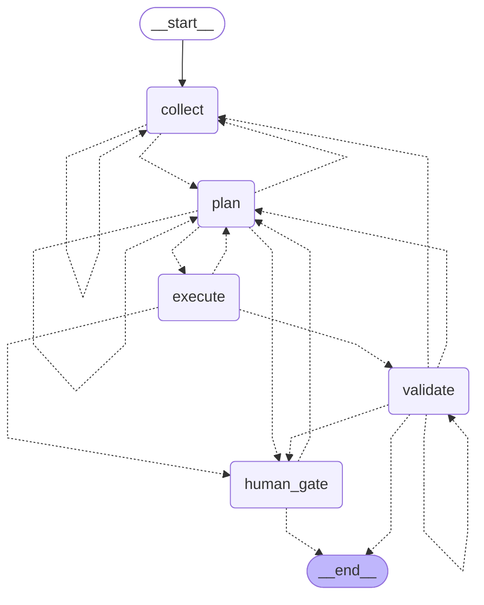
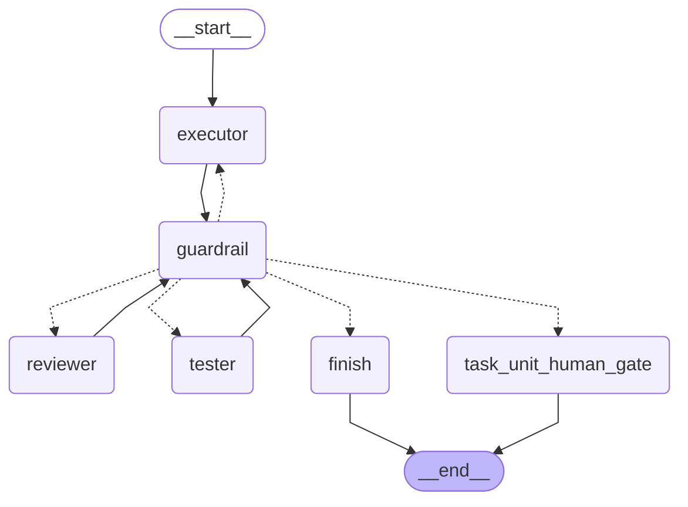
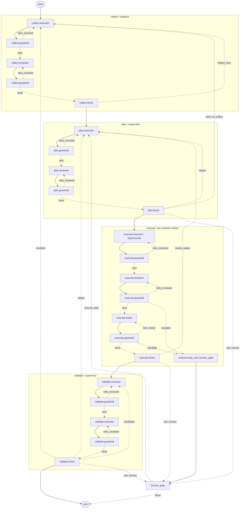

# Native LangGraph Topologies

This file contains:
- the native top-level orchestrator `LangGraph`
- the native reusable `task_unit` subgraph
- one combined detailed view that shows phases together with their internal subphases

The first two graphs are taken directly from `LangGraph`. The combined detailed view is a documentation view built from the native graph topology plus the current runtime contracts in `task_unit_graph.py`, `collect_phase.py`, `plan_phase.py`, `execute_phase.py`, and `validate_phase.py`.

## Top-Level Orchestrator Graph

### Mermaid

### Nodes

| Key | Id | Name |
| --- | --- | --- |
| `__start__` | `__start__` | `__start__` |
| `collect` | `collect` | `collect` |
| `plan` | `plan` | `plan` |
| `execute` | `execute` | `execute` |
| `validate` | `validate` | `validate` |
| `human_gate` | `human_gate` | `human_gate` |
| `__end__` | `__end__` | `__end__` |

### Edges

| Source | Target | Conditional |
| --- | --- | --- |
| `__start__` | `collect` | `False` |
| `collect` | `collect` | `True` |
| `collect` | `plan` | `True` |
| `plan` | `collect` | `True` |
| `plan` | `execute` | `True` |
| `plan` | `human_gate` | `True` |
| `plan` | `plan` | `True` |
| `execute` | `human_gate` | `True` |
| `execute` | `plan` | `True` |
| `execute` | `validate` | `True` |
| `validate` | `__end__` | `True` |
| `validate` | `collect` | `True` |
| `validate` | `human_gate` | `True` |
| `validate` | `plan` | `True` |
| `validate` | `validate` | `True` |
| `human_gate` | `__end__` | `True` |
| `human_gate` | `plan` | `True` |

## Task Unit Graph

### Mermaid

### Nodes

| Key | Id | Name |
| --- | --- | --- |
| `__start__` | `__start__` | `__start__` |
| `executor` | `executor` | `executor` |
| `guardrail` | `guardrail` | `guardrail` |
| `reviewer` | `reviewer` | `reviewer` |
| `tester` | `tester` | `tester` |
| `task_unit_human_gate` | `task_unit_human_gate` | `task_unit_human_gate` |
| `finish` | `finish` | `finish` |
| `__end__` | `__end__` | `__end__` |

### Edges

| Source | Target | Conditional |
| --- | --- | --- |
| `__start__` | `executor` | `False` |
| `executor` | `guardrail` | `False` |
| `guardrail` | `executor` | `True` |
| `guardrail` | `finish` | `True` |
| `guardrail` | `reviewer` | `True` |
| `guardrail` | `task_unit_human_gate` | `True` |
| `guardrail` | `tester` | `True` |
| `reviewer` | `guardrail` | `False` |
| `tester` | `guardrail` | `False` |
| `finish` | `__end__` | `False` |
| `task_unit_human_gate` | `__end__` | `False` |

## Detailed Combined View

This graph is not emitted directly by `LangGraph`; it is a composed documentation view:
- top-level phase routing comes from the native orchestrator graph
- subphase routing comes from the native `task_unit` graph
- repeated task-unit instances are expanded per phase for readability

